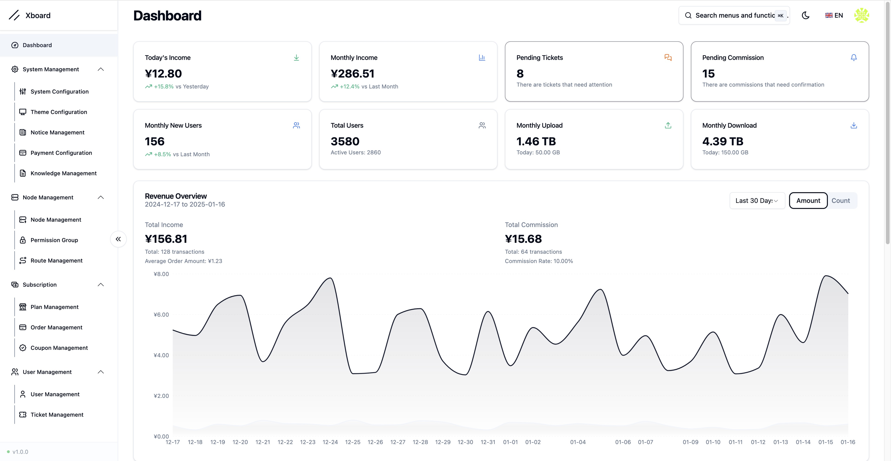
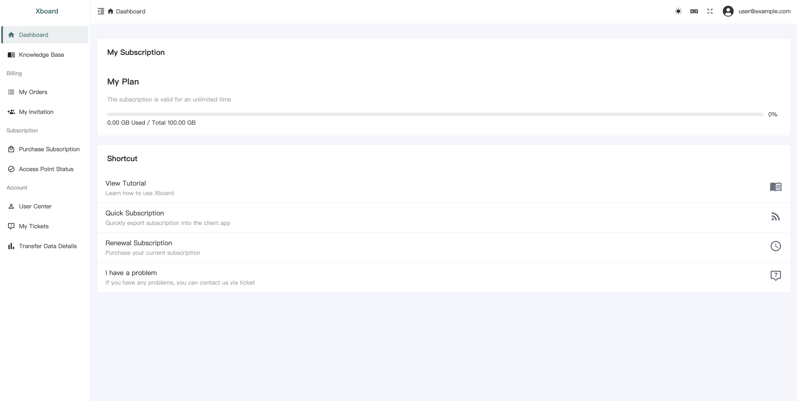

# Xboard

<div align="center">


基于 Laravel + Octane 的代理面板系统，前后端分离，支持用户端与管理端。

</div>

## 重要说明：源码仓库

**本仓库仅保留可维护的源码，不包含任何前端构建产物。**

以下目录已从 Git 历史中移除，且已加入 `.gitignore`，**请勿再次提交**：

| 目录 | 说明 |
|------|------|
| `public/assets/` | 管理端（React）构建输出 |
| `public/theme/` | 用户端旧版主题构建输出 |
| `theme/Xboard/assets/` | 用户端（Vue3）构建输出 |
| `legacy-dist/` | 历史 dist 快照 |
| `theme/v2board/` | 旧版 v2board 主题构建产物 |

克隆后必须**本地构建前端**，否则页面无法正常加载。

## 功能特性

- Laravel 13 + Octane (Swoole) 高性能后端
- 管理端：React + TypeScript + Shadcn UI
- 用户端：Vue3 + TypeScript + Naive UI
- 插件体系、队列（Horizon）、Redis 缓存
- Docker / 1Panel / aaPanel 等多种部署方式
- 节点后端：`xboard-node/`（Go，可与面板联动部署）

## 技术栈

| 层级 | 技术 |
|------|------|
| 后端 | PHP 8.5、Laravel 13、Octane、Horizon |
| 管理端源码 | `frontend/admin` → 构建到 `public/assets/admin` |
| 用户端源码 | `frontend/user` → 构建到 `theme/Xboard/assets` |
| 主题模板 | `theme/Xboard/`（blade、config，不含 assets） |
| 节点服务 | `xboard-node/` |
| 缓存 / 队列 | Redis |

## 仓库地址

https://github.com/cutecat2331234/Xboard

## 环境要求

- PHP **8.5+**（扩展：swoole、redis、pdo、mbstring、bcmath、intl、gmp、curl、zip）
- Composer 2.x
- Node.js **18+**（推荐 22）
- Redis
- MySQL 5.7+ / MariaDB / SQLite（开发可用 SQLite）

## 快速开始

### 1. 克隆仓库

```bash
git clone https://github.com/cutecat2331234/Xboard.git
cd Xboard
```

### 2. 安装后端依赖

```bash
composer install
cp .env.example .env   # 按需修改数据库、Redis 等配置
```

### 3. 构建前端（必须）

```bash
npm --prefix frontend/admin install
npm --prefix frontend/admin run build

npm --prefix frontend/user install
npm --prefix frontend/user run build
```

构建结果写入（已在 `.gitignore` 中，不会进入 Git）：

- `public/assets/admin/` — 管理端静态资源
- `theme/Xboard/assets/` — 用户端静态资源

### 4. 安装与启动

```bash
# 启动 Redis
redis-server --daemonize yes

# 初始化（首次）
ADMIN_ACCOUNT=admin@example.com php artisan xboard:install

# 启动 Octane
php artisan octane:start --server=swoole --host=0.0.0.0 --port=7001
```

访问 `http://localhost:7001/` 为用户端。管理端路径为 `hash('crc32b', APP_KEY)`，`xboard:install` 安装时会输出。

可选队列：

```bash
php artisan horizon
```

### 5. Docker 一键部署（可选）

详见 [Docker Compose 部署文档](./docs/en/installation/docker-compose.md)。

## 目录结构

```
Xboard/
├── app/                    # Laravel 应用代码
├── frontend/
│   ├── admin/              # 管理端 React 源码
│   └── user/               # 用户端 Vue3 源码
├── xboard-node/            # 节点后端（Go）
├── theme/Xboard/           # 用户端主题模板（blade、config）
├── public/                 # Web 根目录（构建后生成 assets）
├── plugins-core/           # 内置插件
├── docs/                   # 文档
└── tests/
```

## 前端开发

开发模式（热更新）：

```bash
npm --prefix frontend/admin run dev
npm --prefix frontend/user run dev
```

本地开发时，可通过环境变量 `VITE_API_PROXY` 将 API 代理指向后端（默认 `http://127.0.0.1:7001`）。

修改前端后重新 `npm run build`，**不要**将 `public/assets/` 或 `theme/Xboard/assets/` 提交到 Git。

## 文档

- [插件开发指南](./docs/en/development/plugin-development-guide.md)
- [Docker Compose 部署](./docs/en/installation/docker-compose.md)
- [1Panel 部署](./docs/en/installation/1panel.md)
- [aaPanel 部署](./docs/en/installation/aapanel.md)
- [从 v2board 迁移](./docs/en/migration/v2board-dev.md)
- [Visual Gate 验收说明](./docs/PARITY-100.md)

## 质量检查

```bash
# 静态分析
vendor/bin/phpstan analyse --memory-limit=1G

# 单元测试
vendor/bin/phpunit

# Visual Gate 报告校验（CI）
make parity-check
```

## 预览





## 免责声明

本项目仅供学习与交流。使用本项目所产生的任何后果由使用者自行承担。

## 参与贡献

欢迎提交 Issue 与 Pull Request。提交前请确认：

1. **不要**提交 `public/assets/`、`theme/Xboard/assets/`、`legacy-dist/` 等构建产物
2. 前端改动需在本地完成 `npm run build` 验证
3. **不要**在文档、脚本或提交信息中写入服务器 IP、密码、管理路径等敏感信息

## License

[MIT](LICENSE)
